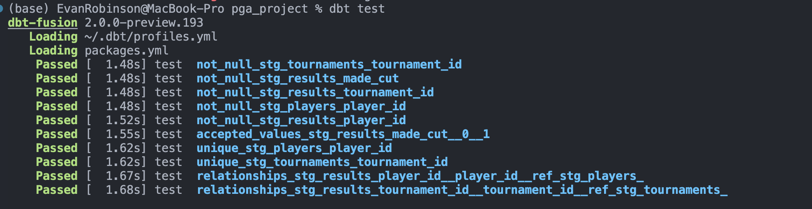

# PGA Tour Analytics (dbt + Snowflake)

A dbt project that transforms raw PGA Tour tournament data into clean, analytics-ready models in Snowflake. Built to demonstrate analytics engineering fundamentals: staging/marts layering, dimensional modeling, testing, and documentation.

## Stack
- **dbt** (Fusion engine) for transformation and modeling
- **Snowflake** as the data warehouse
- **Source data:** ASA PGA Tour tournament-level results, 2015–2022 (~36,800 player-tournament records across 333 tournaments and 500 players)

## Data
The raw dataset contains one row per player per tournament, including finishing position, total strokes, cut status, prize money, and the full strokes-gained breakdown (off the tee, approach, around the green, putting, tee-to-green, and total) — the modern standard for analyzing golf performance.

## Data Quality

All staging models are tested with dbt's built-in tests: `unique` and `not_null` on primary keys, `relationships` to enforce referential integrity between the fact table and dimensions, and `accepted_values` on the cut flag. All 10 tests pass.

## Project structure

## Models

### Staging
| Model | Description |
|-------|-------------|
| `stg_results` | Cleans the raw tournament table: renames columns, casts types, drops unused fields, standardizes strokes-gained metrics. One row per player per tournament. |
| `stg_players` | Distinct list of players (player_id, player_name). 499 players. |
| `stg_tournaments` | Distinct list of tournaments (id, name, course, season, date, purse). 333 tournaments. |

### Marts
| Model | Description |
|-------|-------------|
| `player_season_summary` | Per player per season: tournaments played, cuts made, scoring average, and average strokes gained (total, off-tee, approach, around-green, putting). Strokes-gained values are stored as NULL where untracked rather than misrepresented as zero. |

## Roadmap
- [x] Split staging into `stg_players` and `stg_tournaments` (dimensional model)
- [x] `player_season_summary` mart with strokes-gained breakdown
- [ ] `strokes_gained_leaders` mart
- [x] Add data tests (not_null, unique, relationships)
- [ ] Generate dbt docs with lineage graph

## Running this project
1. Configure a Snowflake connection in `~/.dbt/profiles.yml`
2. Load the source data into `PGA_TOUR.RAW.ASA_TOURNAMENT_RESULTS`
3. Run `dbt debug` to verify the connection
4. Run `dbt build` to build all models and run tests